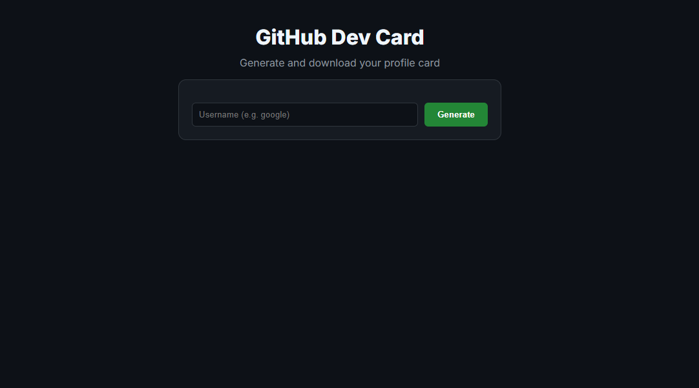
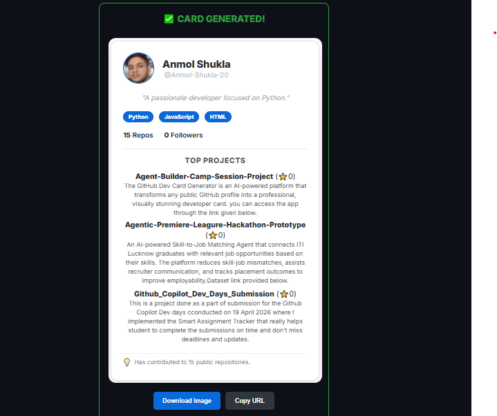

# 🚀 GitHub Dev Card Generator

An AI-powered platform that transforms any public GitHub profile into a visually stunning developer card.

## ✨ Features
- **AI Analysis**: Uses Gemini 1.5 Flash to determine your "developer vibe" and top skills.
- **Quota-Proof Design**: Includes a **Local Fallback Engine** that generates cards even if AI API limits are reached.
- **5 Professional Themes**: Choose from Green, Blue, Black, Yellow, or White high-visibility styles.
- **Image Export**: Download your card as a high-quality PNG instantly.
- **Shareable Links**: Every card is saved and accessible via a permanent URL.
- **Dockerized**: Fully containerized for easy local development or cloud deployment.

## 🛠️ Tech Stack
- **Backend**: FastAPI (Python 3.12)
- **AI Engine**: Google ADK + Gemini 1.5 Flash
- **Tools**: MCP (Model Context Protocol) for GitHub scraping and profile analysis.
- **Frontend**: Single-file HTML/JS with Inter Font and html2canvas.
- **Infrastructure**: Docker, Docker Compose, Google Cloud Run.

## 🚀 Quick Start (Local)

### 1. Prerequisites
- Python 3.12+
- A Google Gemini API Key ([Get one here](https://aistudio.google.com/))

### 2. Setup
Clone the repo and create a `.env` file in the root:
```env
GOOGLE_API_KEY=your_gemini_api_key_here
```

### 3. Run with Docker (Recommended)
```bash
docker-compose up --build
```
- **Frontend**: http://localhost
- **Backend API**: http://localhost:8080

### 4. Run Manually
**Backend:**
```bash
cd backend
pip install -r requirements.txt
uvicorn main:app --host 0.0.0.0 --port 8080
```
**Frontend:**
Simply open `frontend/index.html` in your browser.

## ☁️ Deployment
This project is optimized for **Google Cloud Run**.

**Deploy Backend:**
```bash
gcloud run deploy github-card-backend --source ./backend --region us-central1 --allow-unauthenticated --set-env-vars GOOGLE_API_KEY=YOUR_KEY
```

**Deploy Frontend:**
```bash
gcloud run deploy github-card-frontend --source ./frontend --region us-central1 --allow-unauthenticated --set-env-vars BACKEND_URL=YOUR_BACKEND_URL
```

### UI Appearance:


### Generated Card



## Project Owner:
This Project is developed and created by **Anmol Shukla**. If you have any ideas or you want to collaborate on this project Feel free ot reach out.


